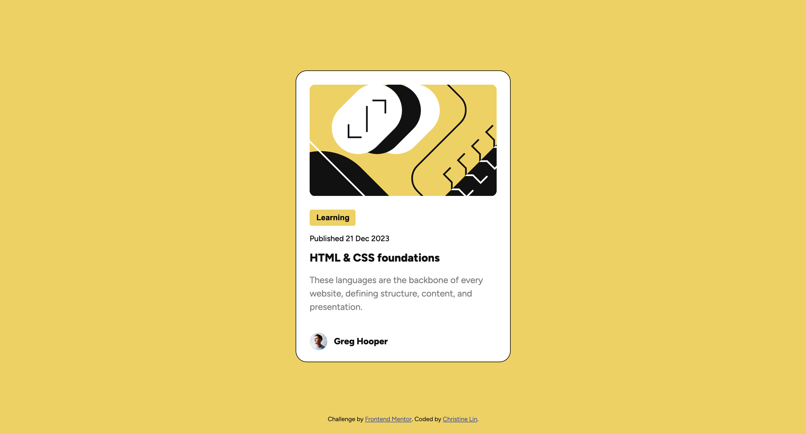
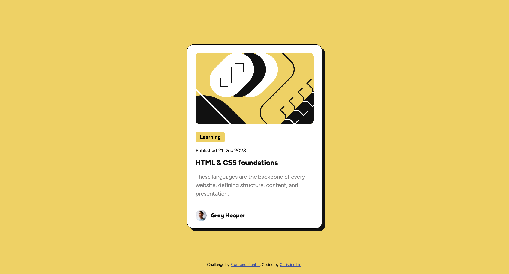

## Table of contents

- [Overview](#overview)
  - [Screenshot](#screenshot)
  - [Links](#links)
- [My process](#my-process)
  - [Built with](#built-with)
  - [What I learned](#what-i-learned)
  - [Continued development](#continued-development)


## Overview

### Screenshot




### Links

- Solution URL: [https://github.com/christinelinster/fm-blog-preview-card](https://github.com/christinelinster/fm-blog-preview-card)
- Live Site URL: [Add live site URL here](https://your-live-site-url.com)

## My process

### Built with

- Semantic HTML5 markup
- CSS custom properties
- Flexbox

### What I learned

At first glance, I wanted to approach the challenge by using some Bootstrap components and making necessary changes for it to align with the expected outcome. However, after linking Bootstrap via CDN I noticed that it had an impact on some of the styles I wanted to apply because of its pre-defined styles with certain classes. 

For example, I initially used a class "container" to capture the entirety of the "card". After applying the class "container" to the div, it seemed to affect the yellow background colour I wanted throughout the entire screen and made it white instead since Bootstrap required specific classes to change the background colour. 

```html
  <div class="course">
    
    <div class="content">
      ...
    </div>
  </div>
```

### Continued development

After struggling with using Bootstrap to design the different elements, I opted to avoid using it as the challenge did not require designs that were closely related to what Bootstrap offers. I will also continue exploring best practices on minimizing the use of classes and repetitive properties to complete the design desired. 

